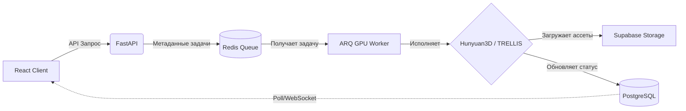

<div align="center">
  
  <h1>AnimaticAI</h1>
  <p><strong>Продвинутая веб-платформа для генерации 3D-моделей из 2D-изображений с автоматическим скелетным риггингом</strong></p>

  

  <p>
    
    
    
    
    
    
    
    
  </p>
</div>

---

## 🌟 О проекте

**AnimaticAI** — это высокотехнологичная full-stack платформа, созданная для того, чтобы стереть грань между 2D-концепт-артами и готовыми к использованию 3D-ассетами. Объединяя передовые диффузионные ML-модели с автоматизированными пайплайнами риггинга, платформа позволяет художникам, разработчикам игр и криэйтерам генерировать 3D-меши, полностью готовые к анимации, прямо из одного изображения.

Помимо мощного ML-ядра, AnimaticAI представляет собой креативное сообщество с встроенной социальной лентой, системой монетизации и интерактивным 3D-портфолио.

---

## ✨ Ключевые возможности (Key Features)

- 🎭 **Генерация 2D-в-3D нового поколения**: Использование SOTA моделей, таких как **Hunyuan3D** и **TRELLIS**, для создания высокополигональных мешей и текстур.
- ✂️ **Умный препроцессинг**: Автоматическое удаление фона и подготовка изображений с помощью **BirefNet** и u2net.
- 🦴 **Автоматический скелетный риггинг**: Мгновенное создание скелета с помощью **MediaPipe** (Pose Landmarking) и невидимая интеграция **Blender/PyMeshLab** для выдачи готовых к анимации моделей.
- 🌐 **Интерактивный 3D-просмотрщик**: WebGL-визуализация 3D-объектов прямо в браузере благодаря **React Three Fiber (R3F)**.
- 👥 **Социальная экосистема**: Глобальная лента работ, профили пользователей, лайки, шеринг моделей и тепловая карта активности (Activity Heatmap).

---

## ⚡ ML Pipeline и Оптимизация VRAM (Лимит 8GB)

Одной из самых сложных инженерных задач этого проекта был запуск передовых (State-of-the-Art) моделей 3D-генерации на **одиночной пользовательской видеокарте всего с 8 ГБ видеопамяти (VRAM)**. По умолчанию такие модели, как Hunyuan3D и TRELLIS, требуют топовых enterprise-ускорителей (от 16 до 24+ ГБ VRAM).

Чтобы добиться стабильного инференса без ошибок **OOM (Out of Memory)**, были проведены масштабные исследования (результаты задокументированы в `Machine_learning/notebooks`) и внедрены следующие оптимизации:

### 🛡️ Стратегии для Low-VRAM окружений:
- **Оптимизированные кастомные форки**: Вместо тяжелых оригинальных репозиториев Tencent, в пайплайн интегрированы кастомные форки с GitHub, предварительно настроенные для окружений с малым объемом VRAM.
- **Снижение точности (FP16/INT8)**: На этапах инференса для компонентов *ShapeGen* и *TexGen* используется половинная точность (`torch.float16`) и квантование весов, что сокращает потребление памяти почти на 50%.
- **Агрессивный Garbage Collection**: Жесткое управление памятью с помощью явных вызовов `torch.cuda.empty_cache()` и `gc.collect()` в конце каждой стадии пайплайна (препроцессинг -> генерация меша -> текстурирование).
- **Изоляция в подпроцессы**: Самые тяжелые участки (например, инференс TRELLIS-2) вынесены в отдельные изолированные Python-подпроцессы. Это предотвращает накопление утечек памяти (memory leaks) в основном API или процессе воркера.

### 🧠 Управление весами моделей

Для работы пайплайна генерации веса ML-моделей должны быть размещены в строго определенных директориях. Система опирается на чекпоинты, специально адаптированные для локального развертывания:

1. **Hunyuan3D-2 (Direct PyTorch Pipeline)**:
   - Сконфигурирована напрямую через PyTorch-бэкенд для высокой скорости локальной обработки. На базе официального репозитория.
   - Целевая директория: `animatic-ai/backend/generation/Hunyuan3D-2/`
2. **Hunyuan3D-1 и TRELLIS-2 (Subprocess Pipeline)**:
   - Используют кастомные веса, оптимизированные для Low-VRAM (портированные независимыми разработчиками).
   - Целевые директории должны быть явно прописаны внутри конфигурационного файла `.env` бэкенда, чтобы ссылаться на ваши локальные пути хранения.

---

## 🏗 Архитектура и Распределенная очередь

AnimaticAI решает проблему масштабируемости тяжелых задач с помощью **Архитектуры распределенной очереди**:
1. **API Gateway (FastAPI)** работает исключительно как быстрая асинхронная точка входа. Он принимает запросы на генерацию, валидирует параметры и резервирует кредиты пользователя.
2. Данные запроса отправляются в брокер сообщений **Redis**.
3. **GPU-воркеры ARQ (Async Redis Queue)** непрерывно опрашивают Redis. Эти воркеры запускаются в полностью изолированном окружении, не блокируя основной поток API.
4. После завершения генерации воркер загружает 3D-ассеты в **Supabase Storage** и обновляет записи в базе данных **PostgreSQL**.
5. Фронтенд получает асинхронное уведомление, обеспечивая плавный UX.



---

## 🚀 Установка и локальное развертывание

> **Инфраструктурная справка:** Платформа опирается на мощную фоновую инфраструктуру. Предполагается, что контейнеры с базами данных (**Supabase**, **Redis**) и туннелем **Cloudflare** уже настроены на вашем ПК и запускаются автоматически в фоновом режиме.

Развертывание основных микросервисов платформы выполняется в несколько терминальных сессий для обеспечения независимой работы Frontend-приложения, API-шлюза и ML-воркеров.

### Шаг 1: Конфигурация окружения
Создайте копию `.env.example` с именем `.env` в корневых директориях фронтенда и бэкенда. Внимательно укажите полные локальные пути к загруженным ML-моделям, а также ключи доступа к Supabase и Redis.

### Шаг 2: Запуск Бэкенда (API Gateway)
Отвечает за маршрутизацию, биллинг и постановку задач в очередь. Откройте PowerShell, активируйте виртуальное окружение и поднимите FastAPI сервер:
```powershell
cd animatic-ai/backend
venv\Scripts\activate.ps1
python main.py
```

### Шаг 3: Запуск GPU-Воркера (ARQ)
Выполняет асинхронную тяжелую ML-генерацию, изолированно от основного API. В **новом** окне PowerShell активируйте то же окружение и запустите слушатель очереди:
```powershell
cd animatic-ai/backend
venv\Scripts\activate.ps1
python -m arq worker.WorkerSettings
```

### Шаг 4: Сборка и запуск Фронтенда
Для максимальной производительности клиентской части используется production-сборка Vite, которая отдается через высокоскоростной preview-сервер. В **третьем** окне терминала выполните:
```powershell
cd animatic-ai
npm run build
npm run preview
```

Платформа успешно развернута! Пользовательский интерфейс доступен в браузере (порт по умолчанию укажет Vite), а Swagger-документация API ждет вас по адресу `http://localhost:8000/docs`.

---

<div align="center">
  <p>Спроектировано и разработано с ❤️, чтобы расширять границы возможностей AI.</p>
</div>
